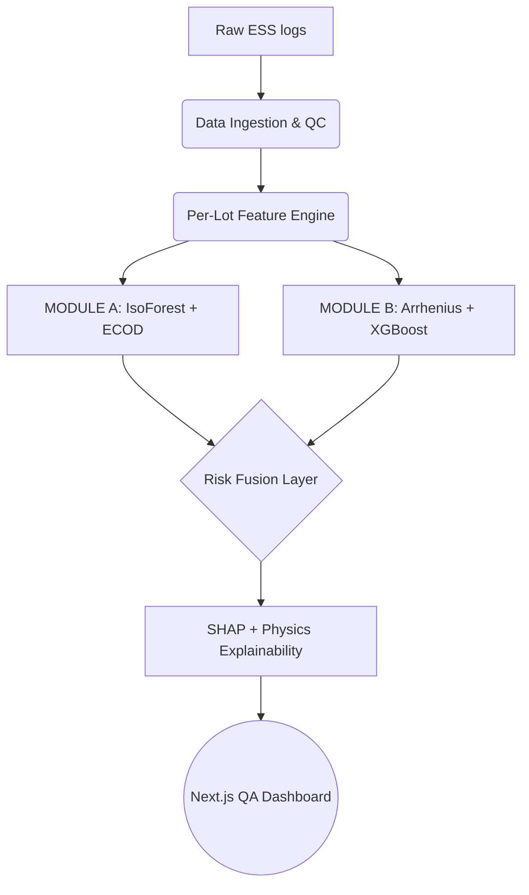

# 🚀 DriftGuard

**AI-Driven Anomaly Detection in Component Burn-In & Screening**  
*Built for ISRO's Smart India Hackathon 2026 (Problem Statement 26170)*


## 📌 The Problem: Latent Defects
In high-reliability sectors like space exploration (ISRO), electronic components undergo rigorous Environmental Stress Screening (ESS) and Burn-In testing (e.g., 125°C for 168 hours). 

Traditional QA screening relies on **static parametric pass/fail limits** (the datasheet max). However, this creates a massive vulnerability:
* **Latent Defects:** Some components pass the absolute datasheet limits (e.g., 50 µA max) but exhibit subtle, anomalous drift over time (e.g., rising from 10 µA to 45 µA). 
* **Catastrophic Failure:** These "walking wounded" components escape into final payloads, degrading prematurely in the vacuum of space where repairs are impossible.

## 💡 The Solution: DriftGuard
DriftGuard is an end-to-end Machine Learning ecosystem designed to predict, detect, and explain latent defects and physical drift during ESS. By fusing dynamic unsupervised anomaly detection with physics-informed predictive modeling, it heavily penalizes false negatives and prevents catastrophic field failures.

### Key Modules:
1. **Module A (Dynamic Outlier Detection):** Instead of relying on static limits, we use Unsupervised ML (Isolation Forest + ECOD) to dynamically calculate the mean of the specific manufacturing lot. A 45 µA part in a 10 µA lot is instantly flagged.
2. **Module B (Time-Series Drift Predictor):** An advanced XGBoost Regressor combined with Arrhenius aging physics. It takes 0h and 24h readings to accurately forecast the 168h drift rate.
3. **Explainability (No Black Boxes):** Integrated SHAP (SHapley Additive exPlanations) generates visual feature attribution graphs so QA inspectors know exactly *why* a part was flagged.

## 📐 Mathematical Foundations

### 1. Lot-Relative Normalization (MAD)
Burn-in lots are small batches. Standard mean/std deviations are fragile to extreme outliers. We use Median Absolute Deviation (MAD):
```math
z_{robust} = 0.6745 \cdot rac{x - median_{lot}}{MAD_{lot}}
```

### 2. ECOD Tail Probability
Empirical Cumulative Distribution Outlier Detection calculates the exact tail probability of seeing a sensor value this extreme, solving the spatial anomaly question.

### 3. Physics Baseline (Arrhenius)
Using 0h and 24h readings, we solve for the physical drift exponent to project the 168h trajectory based on Arrhenius aging principles:
```math
n = [ln(V_{24h}) - ln(V_{0h})] / [ln(24)]
```
```math
I_{168h} = I_0 \cdot (168 / 24)^n
```

### 4. Hybrid ML Residual Correction
An XGBoost regressor predicts the difference between the true 168h value and the physics baseline to minimize Mean Absolute Error (MAE):
```math
I_{final} = I_{physics} + f_{XGB}(residuals)
```

## 🏗️ Architecture & Pipeline



## ⚙️ Tech Stack
- **Frontend (QA Dashboard):** Next.js 14, React, TailwindCSS, Framer Motion, Recharts. Deployed statically on Cloudflare Pages.
- **Backend (ML Engine):** Python 3.11, FastAPI, Scikit-Learn, PyOD, XGBoost, SHAP. Containerized and deployed on SnapDeploy.
- **Data:** Simulated over the UCI SECOM (Semiconductor Manufacturing) Dataset.

## 🚀 Installation & Usage

### 1. Clone the repository
```bash
git clone https://github.com/abhinav29102005/sih2026-170-99.git
cd sih2026-170-99
```

### 2. Run the Next.js Frontend
```bash
cd driftguard
npm install
npm run dev
```
The dashboard will be available at `http://localhost:3000`.

### 3. Run the Python ML Backend
```bash
cd backend
python -m venv venv
source venv/bin/activate
pip install -r requirements.txt
python -c "import sys; sys.path.insert(0, '.'); from server import app; import uvicorn; uvicorn.run(app, host='0.0.0.0', port=8000)"
```
The FastAPI backend will run on `http://localhost:8000`.

---
*DriftGuard: Because in space, there's no room for standard deviation.*
