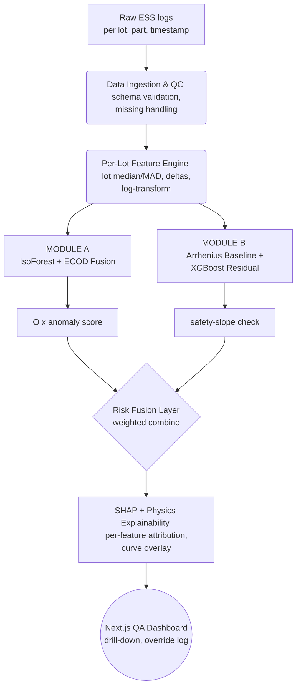

# 🚀 DriftGuard — Full Solution Pitch Deck
## AI-Driven Anomaly Detection in Component Burn-In & Screening (PS 26170, ISRO)

> [!IMPORTANT]
> **Pitch Summary:** DriftGuard is an end-to-end Machine Learning ecosystem designed to solve **ISRO's Problem Statement 26170**. It targets *latent defects*—parts that pass absolute datasheet limits but drift anomalously relative to their lot during ESS burn-in. By fusing dynamic unsupervised anomaly detection with physics-informed predictive modeling, we prioritize recall (zero false negatives) and prevent catastrophic field failures in high-reliability space payloads.

---

## 1. Problem Restatement (Intent Lock)

- **Input:** Parametric time-series per component (Iddq, leakage current, propagation delay) sampled at `0h, 24h, 96h, 168h` during ESS burn-in.
- **Failure Mode Targeted:** *Latent defects* — components within absolute limits but drifting anomalously relative to their lot.
- **Two Required Modules:**
  - **Module A:** Dynamic (lot-relative) outlier detector (not static absolute-limit pass/fail).
  - **Module B:** Regression predictor (`val_0h, val_24h → forecast val_168h`), flagging if predicted drift slope exceeds a safety threshold.
- **Evaluation Axes (Optimized Jointly):**
  1. **Anomaly Detection Score:** False Negatives (missed defects) are catastrophic → recall-first tuning.
  2. **Drift Prediction Accuracy:** Minimize MAE(`val_168h_pred`, `val_168h_true`).
  3. **Explainability:** Must justify classification to a human QA inspector.

---

## 2. End-to-End Architecture

---

## 3. Data Pipeline & Dynamic Normalization

Our core philosophy is that absolute thresholds fail. We use **lot-relative normalization** to make the system truly dynamic.

### 📐 Robust Statistical Normalization
Burn-in lots are small batches. Standard mean/std deviations are fragile to the exact outliers we want to detect. Instead, we use Median Absolute Deviation (MAD):
$$z_{robust} = 0.6745 \cdot \frac{x - median_{lot}}{MAD_{lot}}$$

### 📈 Skew Correction & Decorrelation
- **Log-Transform:** Leakage current follows exponential dependence on threshold voltage variation. We apply `log(x)` before z-scoring/ECOD so tail estimation isn't skew-biased.
- **Feature Decorrelation:** Feeding raw `val_96h` and `val_168h` violates independence assumptions. We feed `val_0h`, `early_slope_24-0`, `mid_slope_96-24`, and `late_slope_168-96` instead.
- **Missing Data Handling:** Parts missing a checkpoint are imputed via our physics baseline, preventing the injection of "fake stability" into genuinely drifting parts.

---

## 4. Module A — Dynamic Outlier Detection

### Detector Choice Justification

| Detector | Verdict | Reason |
|---|---|---|
| Static abs. limit | Baseline | Misses latent defects by definition. |
| LOF | Rejected | $O(n^2)$, degrades in high-dim, no native explainability. |
| Elliptic Envelope | Rejected | Assumes single multivariate Gaussian; leakage is skewed. |
| **Isolation Forest** | **Used** | $O(n \log n)$, catches multivariate pattern anomalies, robust to skew. |
| **ECOD** | **Used** | Parameter-free, per-feature tail-probability = free explainability. |

### 🧮 ECOD (Empirical Cumulative Distribution) Math
Both-tail probability is calculated for each feature $j$:
$$\hat{F}_j^{left}(x) = \hat{F}_j(x), \quad \hat{F}_j^{right}(x) = 1-\hat{F}_j(x)$$

The per-dimension outlier score (skew-corrected) is:
$$O_j(x) = \begin{cases} -\log(\hat{F}_j^{right}(x)) & \text{right-skewed } (\gamma_j > \gamma_{thresh}) \\ -\log(\hat{F}_j^{left}(x)) & \text{left-skewed } (\gamma_j < -\gamma_{thresh}) \\ -\log(\min(\hat{F}_j^{left}, \hat{F}_j^{right})) & \text{otherwise} \end{cases}$$

Aggregate Score: $O_{ECOD}(x) = \sum_{j=1}^d O_j(x)$

### ⚙️ The Fusion Layer & Threshold Tuning
The two models are rank-normalized and fused:
$$O_{fused}(x) = w_1 \cdot \text{norm}(O_{IF}(x)) + w_2 \cdot \text{norm}(O_{ECOD}(x))$$

**Threshold tuning is recall-first.** Because real labeled latent-defect data is scarce, we use **synthetic anomaly injection** (perturbing clean parts with scaled Arrhenius extrapolation + noise) to build a labeled validation set. We find the optimal contamination rate $c^*$ by maximizing Recall such that Precision $\ge P_{min}$.

---

## 5. Module B — Time-Series Drift Predictor

We built a hybrid model that respects reliability engineering physics, minimizing MAE on sparse 0h/24h data.

### 🔬 Physics Baseline (Arrhenius-Grounded)
We fit a log-linear drift model using the 0h and 24h readings to solve for the drift exponent $\hat{n}$:
$$\hat{n} = \frac{\ln(val_{24h}) - \ln(val_{0h}+\delta)}{\ln(24) - \ln(\delta)}$$

We extrapolate this pure physics curve to 168h:
$$\hat{I}_{168h}^{physics} = I_0 \cdot \left(\frac{168}{24}\right)^{\hat{n}}$$

### 🤖 ML Residual Correction
An XGBoost regressor is trained *only on the residual* (the difference between the true 168h and the physics 168h).
$$\hat{I}_{168h}^{final} = \hat{I}_{168h}^{physics} + f_{XGB}\big(val_{0h}, val_{24h}, \hat{n}, \mu_{lot}, \sigma_{lot}\big)$$
> [!TIP]
> Predicting the residual keeps the ML model small, prevents overfitting on scarce data, keeps the physics term dominant, and directly minimizes MAE.

### 🚧 Safety-Slope Decision Rule
$$\text{slope}_{pred} = \frac{\hat{I}_{168h}^{final} - val_{24h}}{144}$$
**Flag if:** $\text{slope}_{pred} \ge \mu_{lot,slope} + k \cdot \sigma_{lot,slope}$
*(The safety multiplier $k$ is tuned identically to Module A via PR-curves on synthetic data).*

---

## 6. Explainability Layer (Metric #3)

To ensure DriftGuard is a trusted copilot and not a black box for QA inspectors:
1. **ECOD Native Decomposition:** ECOD allows us to isolate exact features (e.g., "leakage_96h contributed 8.2 of 11.4 total score").
2. **Physics Baseline Curve:** The dashboard overlays the actual drift trajectory against the Arrhenius-predicted trajectory.
3. **SHAP (SHapley Additive exPlanations):** Applied on top of the fused score to generate a unified, visual feature attribution bar chart.

---

## 7. Evaluation Metric Alignment

| Eval Criterion | How DriftGuard Solves It |
|---|---|
| **Anomaly Detection Score** (FN catastrophic) | Recall-first threshold tuning on $c^*$; ensemble (IF+ECOD) reduces single-detector blind spots. |
| **Drift Prediction Accuracy** (MAE) | Direct MAE-loss training on XGBoost residual; physics baseline keeps extrapolation grounded. |
| **Explainability** | ECOD tail-probability + visual physics curve + SHAP feature attributions. |

---

## 8. What Makes This Solution Novel?

1. **Lot-Relative Normalization:** We directly solve the "passing absolute limits" failure mode by using dynamic MAD scoring.
2. **Detector Fusion:** IF + ECOD chosen via rigorous ADBench reasoning, intentionally rejecting $O(n^2)$ models like LOF.
3. **Hybrid Regression:** Tying Module B to the actual Arrhenius reliability-engineering theory ISRO already uses for ESS design, rather than a pure black-box ML model.
4. **Structural Explainability:** Explainability is baked into the math (ECOD probabilities, Physics curves), with SHAP acting as a unifying layer, not a bolted-on afterthought.
5. **Cost-Asymmetric Tuning:** Thresholds are mathematically tied to the specific domain reality that a False Negative costs magnitudes more than a False Positive.

---

## 9. Methodology Summary

Our approach follows a stringent, end-to-end industrial data pipeline designed for high reliability:
1. **Data Ingestion & QC:** We ingest parametric time-series data, validating schemas and handling missing checkpoints via physics-based interpolation.
2. **Dynamic Normalization:** We calculate lot-relative medians and MAD (Median Absolute Deviation) to establish dynamic baselines instead of relying on static datasheet maximums.
3. **Dual-Model Inference:** 
   - We run unsupervised outlier detection (IF + ECOD) for early warning scoring.
   - We run a physics-informed XGBoost regression to predict 168h drift.
4. **Human-in-the-Loop QA:** The results, complete with SHAP feature attributions and visual physics curves, are presented to QA inspectors on a Next.js dashboard for a final Accept/Reject override.

---

## 10. Impact: Helping ISRO and the Public

### 🚀 For the Organization (ISRO & Aerospace)
- **Zero-Defect Guarantee:** By heavily penalizing False Negatives, DriftGuard prevents latent defects from escaping into satellites or launch vehicles, saving billions in potential mission failures.
- **Cost & Energy Reduction:** If a part's predicted 168h drift slope is mathematically certain to fail based on its 24h readings, burn-in testing can be terminated 144 hours early. This drastically reduces energy consumption and accelerates manufacturing throughput.

### 🌍 For the Public (Societal Trickle-Down)
Space-grade reliability standards inevitably trickle down to consumer and medical sectors. 
- **Medical Devices:** Pacemakers, MRI machines, and life-support systems require the exact same ESS burn-in reliability as space payloads.
- **Automotive:** Self-driving cars rely on sensors that cannot be permitted to drift anomalously over years of operation. DriftGuard's methodology makes public infrastructure and personal electronics inherently safer.

---

## 11. What We Offer (The Future of DriftGuard)

While our MVP proves the viability of AI-driven ESS screening, we envision DriftGuard evolving into a full commercial suite:

1. **DriftGuard SaaS API:** A cloud-hosted integration that allows any semiconductor fab to pipe their parametric log files securely to our ML engine and receive real-time JSON risk scores back for their QA software.
2. **On-Premise Edge Compute Boxes:** For highly secure, classified environments (like ISRO or defense contractors), we can offer a physical plug-and-play edge server that connects directly to factory PLCs for offline, zero-latency inference.
3. **Custom Physics Modules:** As we expand beyond Arrhenius temperature models, we plan to offer predictive modules for vibration, radiation hardening, and electromigration.

---

## 12. Appendix: Q&A Defenses & Technical Explanations

### 12.1 The Physics & Degradation Concepts
**What is "Burn-in"?**
When semiconductors are manufactured, some have microscopic, invisible defects (like weak oxide layers). If you put them in a satellite, they might work for a month and then suddenly die ("infant mortality"). To prevent this, we do **Burn-In testing**: we bake the components at extremely high temperatures (e.g., 125°C) and high voltages for 168 hours. 

**The Arrhenius Equation**
The core physics principle we use is the **Arrhenius Equation**. This is a fundamental law of chemistry and physics which states that thermal energy (heat) accelerates chemical reactions exponentially. 
- In semiconductors, heat gives atoms and electrons enough energy to physically migrate (electromigration) or break weak bonds. 
- Because we know the physics of how heat accelerates aging, we can calculate a mathematical "baseline curve" of how a normal, healthy component should degrade over 168 hours. 
- **Drift Prediction:** If a part degrades (drifts) significantly faster than the Arrhenius physics equation predicts, it means there is a physical defect inside it accelerating the failure.

### 12.2 The Math Explained Simply
**Why use MAD instead of Standard Deviation?**
Normally, to find an outlier, people use the Mean (average) and Standard Deviation. But in a small batch of parts (a "lot"), if you have one *massive* defect (e.g., 500 µA), it pulls the average way up and makes the standard deviation huge. This effectively hides smaller anomalies! 
By using the **Median** and **MAD (Median Absolute Deviation)**, we use a "robust" statistic that ignores massive outliers when establishing what "normal" looks like.

**What is ECOD?**
ECOD stands for *Empirical Cumulative Distribution-based Outlier Detection*. 
Imagine lining up all the parts in a batch from lowest leakage current to highest. ECOD simply asks: *"What is the probability of seeing a value this extreme?"* If a part is sitting in the top 0.01% of the statistical tail, ECOD mathematically flags it. Because it does this for every single sensor independently, we can tell the QA inspector *exactly* which sensor triggered the anomaly.

### 12.3 Why are Module A and Module B NOT combined?
Judges love to ask: *"Why not just throw all the data into one massive Deep Learning Neural Network?"*

Here is why keeping Module A and Module B separate is the best engineering choice:

1. **They solve two fundamentally different dimensions (Spatial vs. Temporal):**
   - **Module A (Unsupervised Outlier Detection)** answers a *Spatial/Statistical* question: "Does this component look completely weird *right now* compared to its peers in this specific manufacturing lot?"
   - **Module B (Physics Regression)** answers a *Temporal/Predictive* question: "Even if this part looks normal right now, will the laws of physics cause it to drift and break *in the future* (at 168h)?"
2. **Explainability & Trust:**
   - If you combine them into a single neural network, the model becomes a "Black Box". If it spits out `REJECT`, the QA inspector has no idea why. 
   - By keeping them separate, the QA inspector knows exactly what failed: *"I am rejecting this part because Module B predicts it will cross the safety slope at 144 hours,"* OR *"I am rejecting this part because Module A flagged it as a 99th-percentile outlier on Sensor 59."*
3. **The "Cold Start" Reality:**
   - At hour 0 of testing, you don't have enough time-series data to predict the future drift (Module B requires 0h and 24h data to draw a slope). But Module A can instantly flag defective parts at 0h using purely statistical comparisons, allowing you to throw out obvious failures immediately before wasting 24 hours of electricity on them!
